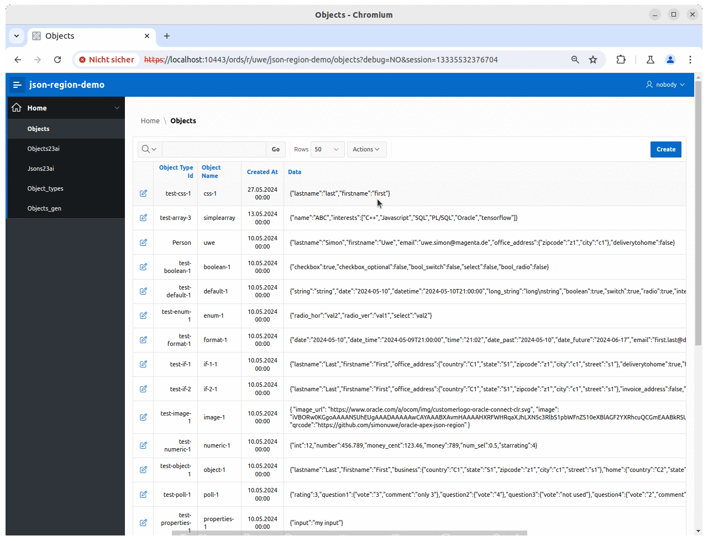

# json-region

An Oracle-APEX-plugin that provides dynamic input items for an easy way to display and edit **JSON-data** in an APEX-application. 
The field-items are dynamically generate based on a JSON-schema. The JSON-schema could be fixed for a page or dynamically based on a JSON-schema found by a SQL_query.

Starting with **Oracle 23ai** a **JSON-schema** could be used for the valition of a column with datatype **JSON**.
So this plugin could also use the JSON-schema of the JSON-validation to **dynamically generate items** to display and/or edit **JSON-data**. 
In this way the field-items of an application always match with the format of your JSON-column.

## Screenshots


## Demo

In directory **examples** you can find a demo-applicaton.

[The demo](examples/demo.md)

## Tutorial

In directory **docu/tutorial** you can find a brief [tutorial](docu/tutorial/tutorial.md).
 

## Idea

More and more database tables contain JSON-columns.
JSON-columns gives us the possibility to show different content in different rows. It is also quite common, that 3rd-party-software offers JSON-columns for customisation. From GUI perspective this requires a dynamic layout a page during runtime.

When you create an Oracle-APEX-application which has to display and edit data from such tables, there should be an easy way to transform this data into seperate input fields or table columns.
Another requirement is the input validation before saving them.

The configuration for these requirements could be solved with a JSON-schema description, for details see https://json-schema.org/
The logic is implemented with PL/SQL and Javascript.

Here an example

**JSON-schema**
```json
{
  "type": "object",
  "required": ["vendor", "model", "os", "purchased_at"],
  "properties": {
     "vendor":        {"type": "string", "maxLength": 20},
     "model":         {"type": "string"},
     "os":            {"type": "string"},
     "cputype":       {"type": "string"},
     "cpus":          {"type": "integer", "min": 1, "max":8},
     "cores":         {"type": "integer", "min": 1},
     "ram":           {"type": "number", "min": 0},
     "storageSize":   { "type": "integer"},
     "purchased_at":  { "type": "string", "format": "date-time"} ,
     "warranty_ends": { "type": "string", "format": "date"} 
   }
}
```

**JSON-data**
```json
{
    "vendor":      "Honor",
    "model":       "Magicbook 16",
    "os":          "Ubuntu 20.04",
    "cputype":     "AMD Ryzen 4800H",
    "cpus":        6,
    "cores":       12,
    "ram":         16384,
    "storageSize": 512,
    "purchased_at": "2022-01-10 12:00:00",
    "warranty_ends":"2024-31-09" 
}
```

It should also be possible to generate the JSON-schema directly from the JSON-data. 

### Cool stuff for Oracle 23ai

#### JSON-validate-constraint

Starting Oracle 23ai a validation of a JSON-column with a JSON-schema via **VALIDATE '...'**  is supported. 
When you want your APEX-application to reference this setting, you can use in the json-region-setup the query 

```
SELECT 
  REGEXP_SUBSTR(search_condition_vc, '''(.*)''$',1,1,'n',1) json_schema
FROM user_constraints c 
JOIN user_cons_columns cc ON(c.table_name=cc.table_name AND c.constraint_name=cc.constraint_name)
WHERE c.table_name='TAB' AND column_name='JSON_DATA'
  AND c.constraint_type='C' AND search_condition_vc like '%IS JSON%';
```

This retrievs the JSON-schema for column **TAB.JSON_DATA** from the data dictionary, as long as the constraint-text is less than 4000 char long (the full text isin a LONG-column, which is not easy to process). So changing this VALIDATE setting will automatically adopt the layout of the json-region in your APEX-UI.

#### JSON-duality-views

The plugin supports INSERT/UPDATE/DELETE and can also retrieve the JSON-schema from a JSON-duality-views.

### JSON collection-tables
The plugin supports SELECT/INSERT/UPDATE on JSON-collection-tables.

### JSON collection-views

In Oracle 23ai JSON-collection-views are always readonly, so only SELECT is supported.

## Know issues

- In SQL-Workshop in APEX-Oracle-Cloud you can not create JSON-Columns (trying this returns ORA-00002 invalid datatype). Here you have to use CLOB columns. 
- When using a CLOB for the JSONs use check constraint **IS JSON(STRICT)** to enforce that the JSON is returned wth **"** enclosed keys..
- In APEX 22.1 there is a general issue (with plugin and without) with "**Modal Dialog** with template **Drawer**", this causes a jquery-error (looks like a datepicker issue). Without "Drawer" all work fine. 
- Theme-Style **redwood-light** does not work as expected (show **Required** even for optional items).

**Caution:** In page-designer, set the **Session State** **Data Type** of the JSON-object to **CLOB**, otherwise the data will be truncated to 8000 characters.

## Current status
- only one schema in **dependentSchemas**
- no schema composition (**OneOf**, **AnyOf**)
- only support of standard APEX-field-validation (APEX's date/date-time Javascript-validation has a Bug, file-/image-upload and required has Bug)
- If JSON-data is stored in a CLOB-column use check-constraint **IS JSON(STRICT)**
- Now with PWA support
- support of arrays (for multiple-choice checkboces)
- support of arrays (single property and object)
- support of file-/image-upload
