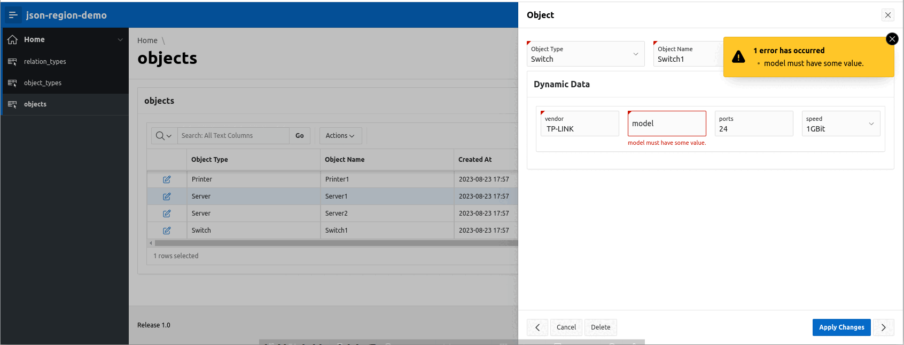

# oracle-apex-json-item

An Oracle-APEX-plugin that dynamicaly provides for each property of a JSON-schema an input field to support an easy way to display and edit a JSON item. 

## Screenshots



## Idea

More and more database tables contain JSON-columns.
JSON-columns gives us the possibility to show different content in different rows. For the GUI perspective this requires a dynamic layout a page during runtime.

When you create an Oracle-APEX-application which has to display and edit data from such tables, there should be an easy way to transform this data into seperate input fields or table columns.
Another requirement is the input validation before saving them.

The configuration for these requirements could be solved with a JSON-schema description, for details see https://json-schema.org/
The logic is implemented with PL/SQL and Javascript.

Here an example

**JSON-schema**
```json
{
  "type": "object",
  "required": ["vendor", "model", "os", "purchased_at"],
  "properties": {
     "vendor": {"type": "string", "maxLength": 20},
     "model": {"type": "string"},
     "os": {"type": "string"},
     "cputype": {"type": "string"},
     "cpus": {"type": "integer", "min": 1, "max":8},
     "cores": {"type": "integer", "min": 1},
     "ram": {"type": "number", "min": 0},
     "storageSize": { "type": "integer"},
     "purchased_at": { "type": "string", "format": "date-time"} ,
     "warranty_ends": { "type": "string", "format": "date"} 
   }
}
```

**JSON-data**
```json
{
    "vendor":      "Honor",
    "model":       "Magicbook 16",
    "os":          "Ubuntu 20.04",
    "cputype":     "AMD Ryzen 4800H",
    "cpus":        6,
    "cores":       12,
    "ram":         16384,
    "storageSize": 512,
    "purchased_at": "2022-01-10 12:00:00",
    "warranty_ends":"2024-31-09" 
}
```

This Oracle-APEX-plugin provides a new item-type **json-item**. 

## Supported datatypes

The supported datatypes for JSON-attributes are
- string
- integer
- number (float)
- boolean

### Supported schema

```JSON
{
  "type": "object",
  "required": [ "propx", "propy", ...],
  "properties": {
    "prop1": { "type": "boolean" },
    "prop2": { "type": "integer", "minimum": 0, "maximum": 100},
    "prop3": { "type": "number", "minimum": 0, "maximum": 100 },
    "prop4": { "type": "string", "maxLength": 99, "pattern": "[A-Z]+[0-9]*"},
    "prop5": { "type": "string", "enum": ["val1", "val2", ..] },
    "prop7": { "type": "string", "format": "date"},
    "prop8": { "type": "string", "format": "date-time"}
    ...
  }
}
```
The datatypes **boolean**, **integer**, **number** and **string** are supported.

The attribute **required** contains all required properties (NOT NULL).

The **type** attribute is mandatory, all others are optional.

Type **string** supports the optional "integer" attributes **minLength** and **maxLength**, a string attribue **pattern** which is a regular-expression like '[0-9A-F]*' for an optional HEX-string and an array **enum**, which contains a list a valid values (emtpy string).

Types **integer** and **number** support the optional "integer"/"number" attributes **minimum**, **maximum**.

### Input validation

- check for mandatory properties
- Check for correct datatype 
- Validate optional attributes

Optional attributes are
- enum (a static list of values)
- maxLength (maximal length of the input)
- min (minimal value for integer, number only)
- max (maximal value for integer, number only)
- pattern (a regular expression)
- date (YYYY-MM-DD)
- date-time (YYYY-MM-DD HH24:MI)

### Not supported JSON-schema attributes
The following attributes defined in JSON-schema are not supported by the APEX-field-validaten and are ignored
- **string**: attributes **minLength**, **time**, **duration**
- **integer**, **number** the attributes **multiplyOf**, **excludeMinimum**, **excludeMaximum**
- **object**: the attributes **minProperties**, **maxProperties**, **dependentRequired**
- **array**: arrays and there attributes are not supported

## Configuration in the APEX-page-designer

To use the json-region-plugin in the APEX-page-designer create a region on your page and set the **type** tom **JSON-Region**.

The plugin provides in the configuration view input for configuring
- the name of the dataitem containing the JSON
- static JSON-schema used in the form 
- dynamic JSON-schema retrieved by a SQL-query. Make sure that the query returns a single row, disable the item when no row could be returned.
- the width used in the form to display the JSON-data

The **readonly** Attribute is supported for the JSON-item.

In the configuration of the json column the **Type** must be **hidden**, and in **Settings** the **Value Protected** must be **switched off**
otherwise an error like
```
1 error has occurred
Session state protection violation: This may be caused by manual alteration of protected page item P16_DATA. If you are unsure what caused this error, please contact the application administrator for assistance.
```
will occure.

### Example-application

The subdirectory **examples** contains a small demo-application to show the possibilities.

## Current status
- Form only, only **simple** JSON-schema without any hierarchy
- no arrays in JSON-schema
- only support of standard APEX-field-validation
- APEX does not support the column-type JSON, use CLOB with check-constraint "ISJSON"
- No PWA support

## Next steps

- support of **$defs**, **$ref**
- support of nested objects
- support of arrays
- support of configurable labels (not only derived from column name)