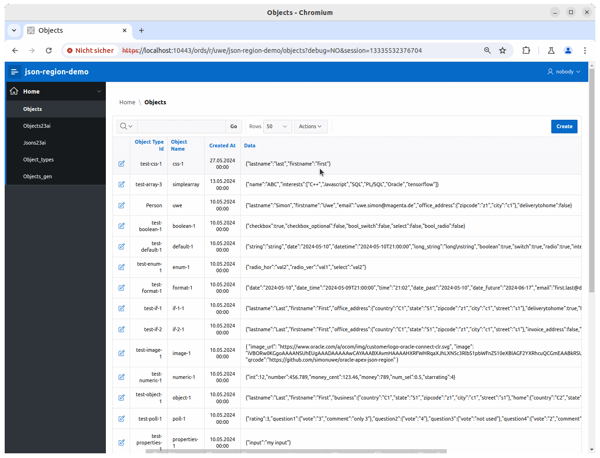

# json-region

An Oracle-APEX-plugin that provides dynamic input items for an easy way to display and edit **JSON-data** in an APEX-application. 
The field-items are dynamically generate based on a JSON-schema. The JSON-schema could be fixed for a page or dynamically based on a JSON-schema found by a SQL_query.

Starting with **Oracle 23c** a **JSON-schema** could be used for the valition of a column with datatype **JSON**.
So this plugin could also use the JSON-schema of the JSON-validation to **dynamically generate items** to display and/or edit **JSON-data**. 
In this way the field-items of an application always match with the format of your JSON-column.

## Screenshots


## Demo

An online demo could be found **[here](https://tlodfjxbrej9i6r-apex01.adb.eu-frankfurt-1.oraclecloudapps.com/ords/r/uwe/json-region-demo/objects)**. You can create new objects and edit existing. When creating a new object you can select one of the existings schemas in **object_types**. Type **Full-Example** and **Hotel** both together show the variaty of supported field-items/formats.

Click here on **menu** on top left and there on **objects**

## Idea

More and more database tables contain JSON-columns.
JSON-columns gives us the possibility to show different content in different rows. It is also quite common, that 3rd-party-software offers JSON-columns for customisation. From GUI perspective this requires a dynamic layout a page during runtime.

When you create an Oracle-APEX-application which has to display and edit data from such tables, there should be an easy way to transform this data into seperate input fields or table columns.
Another requirement is the input validation before saving them.

The configuration for these requirements could be solved with a JSON-schema description, for details see https://json-schema.org/
The logic is implemented with PL/SQL and Javascript.

Here an example

**JSON-schema**
```json
{
  "type": "object",
  "required": ["vendor", "model", "os", "purchased_at"],
  "properties": {
     "vendor":        {"type": "string", "maxLength": 20},
     "model":         {"type": "string"},
     "os":            {"type": "string"},
     "cputype":       {"type": "string"},
     "cpus":          {"type": "integer", "min": 1, "max":8},
     "cores":         {"type": "integer", "min": 1},
     "ram":           {"type": "number", "min": 0},
     "storageSize":   { "type": "integer"},
     "purchased_at":  { "type": "string", "format": "date-time"} ,
     "warranty_ends": { "type": "string", "format": "date"} 
   }
}
```

**JSON-data**
```json
{
    "vendor":      "Honor",
    "model":       "Magicbook 16",
    "os":          "Ubuntu 20.04",
    "cputype":     "AMD Ryzen 4800H",
    "cpus":        6,
    "cores":       12,
    "ram":         16384,
    "storageSize": 512,
    "purchased_at": "2022-01-10 12:00:00",
    "warranty_ends":"2024-31-09" 
}
```

This Oracle-APEX-plugin provides a new region-type **JSON-region**. 


## Supported datatypes

The supported datatypes for JSON-attributes are
- string
- integer
- number (float)
- boolean
- null

In addition the keyword **const** for a constant value is accepted.

### Supported schema

```JSON
{
  "type": "object",
  "required": [ "propx", "propy", ...],
  "properties": {
    "prop1":  { "type": "boolean", },
    "prop2":  { "type": "integer", "minimum": 0, "maximum": 100},
    "prop3":  { "type": "number", "minimum": 0, "maximum": 100 },
    "prop4":  { "type": "string", "maxLength": 99, "pattern": "[A-Z]+[0-9]*"},
    "prop5":  { "type": "string", "enum": ["val1", "val2", ..] },
    "prop7":  { "type": "string", "format": "date"},
    "prop8":  { "type": "string", "format": "date-time"},
    "prop9":  { "$ref": "#/$defs/id"},
    "prop10": { "$ref": "#/$defs/address"},
    "prop11": { "type": "null"},
    "prop12": { "const": "a constant value"},
    "prop13": { "extendedType": "date", "format": "date"},
    "prop14": { "extendedType": "timestamp"},
    ...
  },
  "$defs}:{
    "id"{ "type": "string", "maxLength": 30},
    "address": {
      "type": "object",
       "required": ["zipcode", "town", "street"],
      "properties":{
        "zipcode": {"type": "string"},
        "town":    {"type": "string"},
        "street":  {"type": "string"}
      }
    }
  }
}
```

The attribute **required** contains all required properties (NOT NULL).

The **type** attribute is mandatory, all others are optional.
Types are
- **string** could have an additional attribute **format** 
  - **date** displayed as a date-picker
  - **date-time** displayed as a date-picker
  - **email** a valid email-address
  - **uri** a valid url

  The **string** supports the optional "integer" attributes **minLength** and **maxLength**, a string attribute **pattern** which is a regular-expression (like '[0-9A-F]*' for an optional HEX-string and an array) **enum**, which contains a list a valid values and will be shown as a pulldownlist.
- **integer** with values like 1, 2, 100, ...
- **number** with values like 1.5, 100.50, ...
- **boolean** with values true and false.
- **null** always a NULL value

The **const** attribute identifies a constant value of types **string**, **number**, **integer**, boolean.

The Oracle23-extension to JSON-schema-validation **extendedType** is sopported too. Because **date** always produces a **date-time** a format could be specified to force a **date**

The json-region-plugin uses an optional extension item **"apex"** in the JSON-schema. Here APEX-specific information are specified.
Currently supported are
```
"prop1": {
  "type": "boolean", 
  "apex": {"itemtype": "switch", "label": "your label"}
},
"prop2": {
  "type": "integer", 
  "maximum": 5,
  "apex": {"itemtype": "starrating", "label": "your label"}
},
"prop3": {
  "type": "number", 
  "maximum": 5,
  "apex": {"itemtype": "starrating", "label": "your label"}
},
"prop4": {
  "type": "string", 
  "apex": {"newRow": true, "colSpan": 3, "lines": 5, "label": "your label"}
},
"prop4": {
  "type": "string", 
  "apex": {"itemtype": "radio", "enum": ["val1", "val2",...]}
},

```
- **label** could be used in any **type**, it is used to set a specific label for the input-item.
- **newRow** starts a new row, so the current filed will be the first i this row.
- **lines** defines for long strings the rows used for the textarea.
- **colSpan** defines the width of the item (values are 1-12)

- **itemtype** defines how the item is shown in APEX
  - **switch** changes for **boolean** the default checkbox to a switch.
  - **starrating** uses for the numeric types **integer** and **number** stars to enter the value. The property **maximum** (which also defines in JSON-schema the max value for the item) is used for the number of displayed stars.
  - **radio** uses a radio group to show the values of an enum.

### Input validation

- check for mandatory properties
- Check for correct datatype 
- Validate optional attributes

Optional attributes are
- maxLength (maximal length of the input)
- minimum (minimal value for integer, number only)
- maximum (maximal value for integer, number only)
- pattern (a regular expression)

### Not supported JSON-schema attributes
The following attributes defined in JSON-schema are not supported by the APEX-field-validaten and are ignored
- **string**: attributes **minLength**, **time**, **duration**
- **integer**, **number** the attributes **multiplyOf**, **excludeMinimum**, **excludeMaximum**
- **object**: the attributes **minProperties**, **maxProperties**, **dependentRequired**
- **array**: arrays and there attributes are not supported

## Configuration in the APEX-page-designer

To use the json-region-plugin in the APEX-page-designer create a region on your page and set the **Type** to **JSON-Region**.
In **Source** enter the name for the hidden JSON-item which is used in the form

The plugin provides in the configuration view input for configuring
- A **static JSON-schema** used in the form. Starting with **Oracle 23c** a **JSON-schema** for **column-validation** is stored in the **datadictionary**. The Plugin tries to use this when the static **schema** is left empty. This keeps the schema of the JSON-column an the UI for this column in sync.  
- A **dynamic JSON-schema** retrieved by a SQL-query. Make sure that the query returns a single row, disable the item when no row could be returned.
- the **Column width** is used in the form for the width of the input items (values are 1-12)
- When the **maxLength** of an item is above the **Textarealimit** a **textarea** is used for then string-item instead of the **text-field**.
- If **Headers** is set, the plugin will generate additional headers for nested objects.
- If **Hide JSON** is unset, the Item with the JSON data is shown on the form, otherwqise it will be hidden
- If **Keep additional attributes** is set, the plugin will keep for updating the data all attributes not mentioned in the JSON-schema.
- If **Remove NULLs from JSON** is set, all attributes with value **null** will be remove make the generated JSON more compact.

The **readonly** Attribute is supported for the JSON-region.

In the configuration of the json column the **Type** must be **text** or **textara**. This item is set to hidden when the plugin is initialized. This is required, because otherwise APEX does not recoginse the data is changed in the region.

### Example config
The JSON-CLOB is named **P16_DATA**, the schema ist stored in table **object_type** and can be selected by **object_type_id=:P16_OBJECT_TYPE_ID**

Configuration of the **JSON-data-column**


Configuration of the **JSON-region**


### Installing the Plugin

The plugin could be found in subdirectory **plug-in** file 
**region_type_plugin_json_region_uwesimon_selfhost_eu.sql**
Import this SQL-file in your application in the **shared-components->plugins** dialog.

### Example-application

The subdirectory **examples** contains a small demo-application to show the possibilities. Go into this directory and install from there.

### Cool stuff for Oracle 23c

Starting Oracle 23c a validation of a JSON-column with a JSON-schema via **VALIDATE '...'**  is supported. 
When you want your APEX-application to reference this setting, you can use in the json-region-setup the query 

```
SELECT 
  REGEXP_SUBSTR(search_condition_vc, '''(.*)''$',1,1,'n',1) json_schema
FROM user_constraints c 
JOIN user_cons_columns cc ON(c.table_name=cc.table_name AND c.constraint_name=cc.constraint_name)
WHERE c.table_name='TAB' AND column_name='JSON_DATA'
  AND c.constraint_type='C' AND search_condition_vc like '%IS JSON%';
```

This retrievs the JSON-schema for column **TAB.JSON_DATA** from the data dictionary, as long as the constraint-text is less than 4000 char long (the full text isin a LONG-column, which is not easy to process). So changing this VALIDATE setting will automatically adopt the layout of the json-region in your APEX-UI.

The datatype **DATE** is not native to JSON-schema, where it is documented as
``` 
{
  "type": "string",
  "format": "date",
  ...
}
```
For date/time handling JSON-schema knows the formats
**date** (2023-10-28), **date-time** (2023-10-28T10:15:00), **time** (12:15:10) and **duration** (5H10M for 5:10 hours) which implements the date/timeformats from ISO8601

Oracle 23c does not implement it this way.
As for the native datatye **DATE** the json formats **date** and **date-time** always result in date+time..
Also Oracle introduced a new keyword **extendedType** for defining date/

```
{
  "extendedType": "date",
  ...
}
```

which is **date-time** in JSON-schema-definition too !!!!

To handle "standard-JSON-schema" date/time data the vaidation of the JSON-column with the JSON-schema must be defined as
```
IS JSON VALIDATE CAST '{...}' 
```

You can write now
```
{
  ...
  "created": "2023-10-28"
  ...
}
```
to the json-column, but when reading it back you will get
```
{
  ...
  "created": "2023-10-28T00:00:00"
  ...
} 
```
This could cause some trouble when comparing "old" and "new" values.

## Know issues

- In SQL-Workshop in APEX-Oracle-Cloud you can not create JSON-Columns (trying this returns ORA-00002 invalid datatype). Here you have to use CLOB columns. 
- When using a CLOB for the JSONs use check constraint **IS JSON(STRICT)** to enforce that the JSON is returned wth **"** enclosed keys..

## Current status
- Form only, only **simple** JSON-schema with nested objects
- no arrays in JSON-schema
- no schema composition (AllOf, OneOf, Anyof)
- only support of standard APEX-field-validation (APEX's date/date-time Javascript-validation has a Bug)
- If JSON-data is stored in a CLOB-column use check-constraint **IS JSON(STRICT)**
- Now with PWA support

## Next steps

- (partial) support of arrays