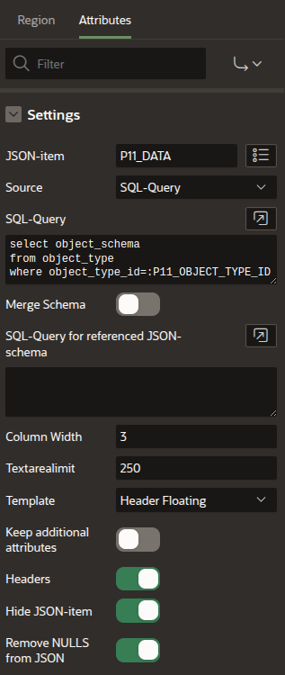
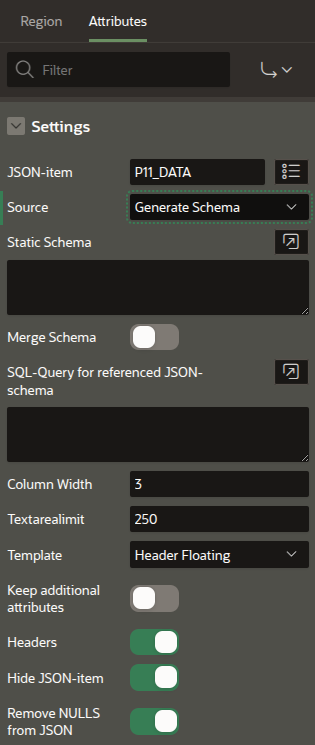

# json-region

An Oracle-APEX-plugin that provides dynamic input items for an easy way to display and edit **JSON-data** in an APEX-application. 
The field-items are dynamically generate based on a JSON-schema. The JSON-schema could be fixed for a page or dynamically based on a JSON-schema found by a SQL_query.

Starting with **Oracle 23ai** a **JSON-schema** could be used for the valition of a column with datatype **JSON**.
So this plugin could also use the JSON-schema of the JSON-validation to **dynamically generate items** to display and/or edit **JSON-data**. 
In this way the field-items of an application always match with the format of your JSON-column.

This Oracle-APEX-plugin provides a new region-type **JSON-region**. 

## Supported datatypes

The supported datatypes for JSON-attributes are
- string
- integer
- number (float)
- boolean
- null

In addition the keyword **const** for a constant value is accepted.

### Supported schema

```JSON
{
  "obj1":{
    "type": "object",
    "required": [ "propx", "propy", ...],
    "properties": {
      "prop1":  { "type": "boolean", },
      "prop2":  { "type": "integer", "minimum": 0, "maximum": 100},
      "prop3":  { "type": "number", "minimum": 0, "maximum": 100 },
      "prop4":  { "type": "string", "default": "abc", "maxLength": 99, "pattern": "[A-Z]+[0-9]*"},
      "prop5":  { "type": "string", "enum": ["val1", "val2", ..] },
      "prop7":  { "type": "string", "format": "date"},
      "prop8":  { "type": "string", "format": "date-time"},
      "prop8":  { "type": "string", "format": "time"},
      "email":  { "type": "string", "format": "email"},
      "uri":    { "type": "string", "format": "uri"},
      "image":  { "type": "string", "contentEncoding": "base64", "contentMediaType": "image/png"},
      "prop9":  { "$ref": "#/$defs/id"},
      "prop10": { "$ref": "#/$defs/address"},
      "prop11": { "type": "null"},
      "prop12": { "const": "a constant value"},
      "prop13": { "extendedType": "date", "format": "date"},
      "prop14": { "extendedType": "timestamp"},
      ...
    },
    "additionalProperties": true
  },
  "arr1": {
    "type": "array",
    "items": {"type": "string", "enum": ["val1", "val2", ..]}
  },
  "$defs":{
    "id": { 
      "type": "string", 
      "maxLength": 30
    },
    "address": {
      "type": "object",
       "required": ["zipcode", "town", "street"],
      "properties":{
        "zipcode": {"type": "string"},
        "town":    {"type": "string"},
        "street":  {"type": "string"}
      }
    }
  }
},
```

The attribute **required** contains all required properties (NOT NULL).

The **type** attribute is mandatory, all others are optional.
Types are
- **object** is an object with **properties**, for each property UI-widgets are created
- **array** is an array of **items**. It is only supported as a "simple array" (string, integer, number) which generates a multiselection checkbox-group with a **checkbox per enum value**. The array stores the checked items.
- **string** could have an additional attribute **format** 
  - **date** displayed as a date-picker
  - **date-time** displayed as a date-picker
  - **time** displays an hour and a minute spinner (in Chrome an additional icon button for a select popup).
  - **email** a valid email-address
  - **uri** a valid url
  
  The type **string** supports **base64** encoded binary data **contentEncoding** 
  for displaying **images** via **contentMediaType** in formats **png**, **jpg** or **gif** (This item will be **readonly**). 
```JSON
  { 
    "type": "string", 
    "contentEncoding": "base64", 
    "contentMediaType": "image/png"
  }
```

  The type **string** supports the optional "integer" attributes **minLength** and **maxLength**, a string attribute **pattern** which is a regular-expression (like **'[0-9A-F]*'** for an optional HEX-string and an array) **enum**, which contains a list a valid values. The enum will be shown as a pulldownlist.
- **integer** with values like 1, 2, 100, ...
- **number** with values like 1.5, 100.50, ...
- **boolean** with values true and false.
- **null** always a NULL value

The **default** attribute can be added to each property. It must have the same type as the related property, so when type=integer it must be an integer.

The **readOnly** sets a single object/property to readonly, so it can not be changed in the APEX-UI.

For properties with format **date**, **date-time** and **time** the **default** could be **NOW** or **now**, which means the current date for a **date**, the current date-time for **date-time** and the current time for **time**.

The optional **additionalProperties** defines whether the object is allowed to have properties not defined in then JSON-schema. This additional properties are kept when updating the data. This should be set to **false** when conditional schemas are used, otherwise all items will be stored in the JSON-data and not only the "visible" once.

The **const** attribute identifies a constant value of types **string**, **number**, **integer** or **boolean**.

The Oracle23ai-JSON-schema-extension **extendedType** is supported too. Because **date** always produces a **date-time** a format could be specified to force a **date**

### Advanced schema

The json-region-plugin uses an optional extension item **"apex"** in the JSON-schema. Here APEX-specific information are specified. To get more flexible UIs the properties **"dependentRequired"**, **"dependentSchema"**, **"if"**, **"then"** and **"else"** are supported too.

Every property-type supports
```JSON
{
  "apex": {
    "label":       "your label",
    "placeholder": "your placeholder"
  }
}
```
Currently supported are
```JSON
{ "type": "object"
  "properties": {
    "prop1": {
      "type": "boolean", 
      "apex": {
        "itemtype": "switch"
      }
    },
    "prop2": {
      "type": "integer", 
      "maximum": 5,
      "apex": {
        "itemtype": "starrating", 
        "align": "right"
      }
    },
    "prop3": {
      "type": "number", 
      "maximum": 5,
      "apex": {
        "itemtype": "starrating"
        }
    },
    "prop4": {
      "type": "string",
      "default": "abc", 
      "apex": {
        "newRow": true, 
        "colSpan": 3, 
        "lines": 5
      }
    },
    "image": {
      "type":   "string",
      "format": "uri", 
      "apex": {"itemtype": "image"}
    },
    "prop5": {
      "type": "string",
      "readOnly": true,  
      "enum": ["val1", "val2", ...], 
      "apex": {
        "itemtype": "radio", 
        "enum": {
          "val1": "disp1", 
          "val2": "disp2",
          ...
        }, 
        "direction": "horizontal"
      }
    },
    "prop6": {
      "type": "array",
      "items": {
        "type": "string", 
        "enum": ["val1", "val2", ...]
      },
      "apex":  {"itemtype": "combobox"} 
    },
    "prop6": {
      "type": "array",
      "items": {
        "type": "string", 
        "enum": ["val1", "val2", ...]
      },
      "apex":  {
        "itemtype": "selectmany",
        "enum": {
          "val1": "disp1", 
          "val2": "disp2", 
          ...
        }
      } 
    },
    "prop8": {"type": null},
    "prop9": ["const": "const string"],
    "prop10": {
      "type": "string", 
      "apex": {"itemtype": "qrcode"}
    }
  ...
  },
  "required": ["prop1", "pro2", ...],
  "dependentRequired": {
    "prop1": ["prop4", ...]
  },
  "dependentSchemas": {
    "prop1": { 
      "properties": {
        "prop11": {"type": "integer"},
        "prop12": {"type": "string"},
        ....
      }
     }
  },
  "if": {
    "anyOf": {
      "not": { "required": ["prop3"]},
      "properties": {
        "allOf": [
          { "prop1": { "const": true }},
          { "prop2": { "enum": ["val1", "val2"] }}
        ]
      }
    }
  },
  "then": {
    "properties": {
      "prop1a": { "type": "string" }
    }
  },
  "else": {
    "properties": {
      "prop1b": { "type": "string", "format": "date" }
    }
  }

}
```
#### Advanced APEX-properties

The **type** **array** is supported for multiselect checkbox-groups, the checkboxes are generate from the **enum**. 
With APEX >=23.2 it supports the **combobox** which allows chips and the input of additional values beside the valies defined in the enum.
With APEX >=24.1 it supports the **selectOne** ans **selectMany**.

Optional configurations for the UI could be done with the **"apex": {...}**. The supported  properties are
- **label** could be used in any **type**, it is used to set a specific label for the input-item.
- **placeholder** the text shown when the inputfield is empty (iggnored for checkboxes, switches and radiobuttons).
- **align** positions integer/number **left**, **center**, **right** in the input-item.
- **textcase** for converting strings into **lower** or **upper**
- **newRow** starts a new row, so the current filed will be the first i this row.
- **textBefore** defines text with is shown in a row above the current field. This can be used for logically grouping properties. This will always start a **newRow** 
- **lines** defines for long strings the rows used for the textarea.
- **colSpan** defines the width of the item, values are 1 (small)  to 12 (full width)
- **enum** is used for mapping the JSON-values to display-values.
For example JSON-data has **"enum": ["a", "b", "c"]**, so the **"apex": {"enum": {"a": "dispA", "b": "dispB", "c": "dispC"}}** will map a->dispA, ... in the APEX-UI.
- **format** is used for changing the display format of a JSON-value. Currently **format** supportes only **currency** which will show **integer** and **number** values with a currency symbol and **number** with 2 decimal places and **integer** without an decimal places.
- **placeholder** defines the placeholder shown wwhilehen field is empty.
- **template** used for the input item values are **floating** (default), **left**, **above** and **hidden**
- **css** defines the CSS-classes added to the form-field of the UI-item
- **itemtype** defines which UI-item is used in the APEX-UI
  - **password** the text is not shown but a * for each character.  
  - **switch** changes the display for a **boolean** to a switch, the default is a single checkbox.
  - **starrating** uses for the numeric types **integer** and **number** stars to enter the value. The property **maximum** (which also defines in JSON-schema the max value for the item) is used for the number of displayed stars.
  - **checkbox** use checkboxes for the values of an **array** of **string** with an **enum**. 
  - **radio** use a radio group for the values of an **enum** (default is a selectlist).
  - **image** use the string as an URL for an image (**format** must be **uri** too).
  - **combobox** to support a combobox with **chips** for an **array** of **string** with an **enum** (for APEX >=23.2)
  - **richtext** to support a textarea with a richtext-editor (for APEX >=23.2). Use **collspan the use expand the columns, so that the iconbar of the richtext-editor fits  
  - **qrcode** will display (the item will be readonly) a **string** as qrcode (for APEX >= 23.2).

For a better support of questionnaires, the output direction for itemtypes **radio** and **checkbox**  could be specified with **"direction": "horizontal"** (place the radiobutton or checkbox in a line), default is **vertical** (place in a column)

#### Advanced JSON-schema properties

  - With **dependentRequired** fielditems could be set to **required** depending on a **not empty** fielditem.
  - With **dependentSchemas** the fielditems could be shown depending on an **not empty** fielditem, currently only one dependent schema is supported.
  - The 3 properties **if**, **then**, **else** support conditional "UI-parts". Properties could be compared by **==** via ```"prop": {"const": "val"}``` or **in** via (```"prop": {"enum": ["val1", "val2"] }```
  For example in case the boolean **differentBillingAddress** is true additional entry items for a 2nd address are shown.
  The keywords **allOf** (AND), **anyOf** (OR), **not** (NOT) and **required** support more complex conditions.

Details could be found in at https://json-schema.org

### Mapping APEX-item config to JSON-Schema

The table shows the mapping of the configuration of an item **field1** to the **JSON-schema**

The supported Identification types

| APEX-Item Identification Type | JSON-Schema | Comment |
|-------------------------------|-------------|---------|
| Checkbox | {"field1": {"type": "boolean"} }| |
| Checkbox Group | {"field1": "type": "array", "items": {"type": "string", "enum": ["val1", "val2", ...]}} |
| Color Picker | --- |
| Combobox | {"field1": "type": "array", "apex": {"itemtype": "combobox"}, "items": {"type": "string", "enum": ["val1", "val2", ...]}} | No separate display values
| Datepicker: Settings: Show Time: false| {"field1": {"type": "string", "format": "date"} |
| Datepicker: Settings:  Show Time: true| {"field1": {"type": "string", "format": "date-time"} |
| Display Image | {"field1": { "type": "string", "contentEncoding": "base64", "contentMediaType": "imagetype"}} | imagetypes: jpg, png, gif |
| Display Map | --- |
| Display Only: Format Pain text | {"field1": "type": "...", "readOnly": true} |
| Hidden | --- |
| File Upload | --- |
| Geocoded Address | --- |
| Hidden | --- |
| Image Upload | --- |
| List Manager | --- |
| Markdown Editor | --- |
| Number Field | {"field1": {"type": "number"}} |
| Password | {"field1": { "type": "string", "writeOnly": true", "apex": {"itemtype": "password"}}} | "writeOnly": true forces new password input when mandatory |
| Percent Graph | {"field1": {"type": "number", "apex": {"itemtype": "pctgraph"}}} | Supported types "number" and integer" |
| Popop LOV | --- |
| QR-code: Data Type: Plain Text, Size: Default| {"field1": {"type": "string", "apex": {"itemtype": "qrcode"}}} | Support for types "string", "integer", "number" |
| Radio Group | {"field1": {"type" "string", "enum": ["val1", "val2"], "apex": {"itemtype": "radio"}} |
| Rich Text Editor | {"field1": {"type": "string", "apex": {"itemtype": "richtext"}}} | Format Markdown only |
| Select List: List of Values: Type: Static Values | {"field1": {"type": "string", "enum": ["val1", "val2", ...]}} | Support for types "string", "integer", "number" |
| SelectOne: List of Values: Type: Static Values | {"field1": {"type": "string", "enum": ["val1", "val2", ...], "apex":{"itemtype": "selectone"}}} | Support for types "string", "integer", "number" |
| SelectMany | {"field1": "type": "array", "apex": {"itemtype": "selectmany"}, "items": {"type": "string", "enum": ["val1", "val2", ...], "apex"{"enum": {"val1": "disp1", "val2": "disp2, ...}}}} |
| Shuffle | --- | |
| Star Rating | {"field1": {"type": "integer", "maxValue": 5, "apex": {"itemtype": "starrating"}}} | Supported types "integer" and "number" |
| Switch | {"field1": {"type": "boolean", "apex": {"itemtype": "switch"}} |
| Text Field | {"field1": {"type": "string"}} |
| Text Field with Autocomplete | --- |
| Textarea | {"field1": {"type": "string"}, "apex": {"itemtype": "textarea"}} |

Appearance 

| Template            | JSON-Schema | Comment |
|---------------------|-------------|---------|
| Hidden              | --- |  |
| Optional            | --- |  |
| Optional - Above    | --- |  |
| Optional - Floting  |     | Depends on "required" |
| Required            | --- |  | 
| Required - Above    | --- |  |
| Required - Floating |     | Depends on "required" |

Other supported configurations.

| APEX-item-config  | JSON-Schema | Comment |
|-------------------|-------------|---------|
| Name              | {"field1": {"type": "...", "apex": {"label": "Label1"}}} | use "Label1" instead of default (separate words, 1st case upper case rest lower) |
| Subtype           | {"field1": {"type": "string", "format": "uri"}} | supported formats for **string** are **uri**, **email** | 
| Textcase          | {"field1": {"type": "string", ..., "apex": {"textcase": "lower", ...}}} | supported values **lower**, **upper** |
| Value Required    | {"type": "object", "required": ["field1", ...]} |
| Maximum Length    | {"field1": {"type": "...", "maxLength": "---"}} |
| CSS Classes       | {"field1": {"type": "...", "apex": {"css": "class1 class2"}}} | |
| Format Mask       | {"field1": {"type": "...", "format": "format1"}}   |
| Value Placeholder | {"field1": {"type": "...", "apex": {"placeholder": "placeholder"}}} |
| Start New Row     | {"field1": {"type": "...", "apex": {"newRow": true}}} |
| Column            | {"field1": {"type": "...", "apex": {"colSpan": "3"}}} | spans 1 .. 12 |
| New Column        | --- | always true |
| Default: Type: Static | {"field1": {²type": "...", "default": "value1"}} | For "type": date, date-time, time: "now" is current date, current timstamp or current time |
| Read Only: Type: Always | {"field1": {"type": "...", "readOnly":"true}} |
| Settings: Minimum Value | {"field1": {"type": integer", "maximum": 123}} | Supported Types "integer", "number", "date", "date-time", "time" |
| Settings: Maximum Value | {"field1": {"type": integer", "minimum": 123}} | Supported Types "integer", "number", "date", "date-time", "time" |
| Settings: Number Alignment | {"field1": {"type": integer", "apex": {"align": "right"}|  Supported are alignements left, center right|

Settings for the whole region

| APEX-item-config | JSON-Schema |
|------------------|-------------|
| Read Only Type: Always | {"type": "object", "readOnly": true, ...} |

### Input validation

- check for mandatory properties
- Check for correct datatype 
- Validate optional attributes

Optional attributes are
- maxLength (maximal length of the input)
- minimum (minimal value for integer, number only)
- maximum (maximal value for integer, number only)
- pattern (a regular expression)

### Not supported JSON-schema attributes
The following attributes defined in JSON-schema are not supported by the APEX-field-validaten and are ignored
- **string**: attributes **minLength**, **time**, **duration**
- **integer**, **number** the attributes **multiplyOf**, **excludeMinimum**, **excludeMaximum**
- **object**: the attributes **minProperties**, **maxProperties**,  - **array**: arrays and there attributes are not supported

## Configuration in the APEX-page-designer

To use the json-region-plugin in the APEX-page-designer create a region on your page and set the **Type** to **JSON-Region**.
In **Source** enter the name for the hidden JSON-item which is used in the form

The plugin provides in the configuration view input for configuring
- The **Source** for the JSON-schema
  - There is **no fixed schema**. The JSON-schema is always generated based on the JSON-data. This uses "default" UI-items and will only generate UI-items for the existing properties in the JSON-data. There will not be **required** properties.
  - A **static JSON-schema** used in the form. Starting with **Oracle 23ai** a **JSON-schema** for **column-validation** is stored in the **datadictionary**. The Plugin tries to use this when the static **schema** is left empty. This keeps the schema of the JSON-column an the UI for this column in sync.  
  - A **dynamic JSON-schema** retrieved by a SQL-query. Make sure that the query returns a single row, disable the item when no row could be returned.
- the **Column width** is used in the form for the width of the input items (values are 1-12)
- When the **maxLength** of an item is above the **Textarealimit** a **textarea** is used for then string-item instead of the **text-field**.
- If **Headers** is set, the plugin will generate additional headers for nested objects.
- **template** defines the default template for all items. This is similar to the item-template configuration, except that the optional/require templates depend on the **required** of the JSON-schema. Default is **Label Floating**.
- If **Hide JSON** is unset, the Item with the JSON data is shown on the form, otherwqise it will be hidden
- If **Keep additional attributes** is set, the plugin will keep for updating the data all attributes not mentioned in the JSON-schema.
- If **Remove NULLs from JSON** is set, all attributes with value **null** will be remove make the generated JSON more compact.

The **readonly** Attribute is supported for the JSON-region.

In the configuration of the json column the **Type** must be **text** or **textara**. This item is set to hidden when the plugin is initialized. This is required, because otherwise APEX does not recoginse the data is changed in the region.

### Example config

The JSON-CLOB is named **P2_DATA**, the schema ist stored in table **object_type** and can be selected by **object_type_id=:P2_OBJECT_TYPE_ID**

Configuration of the **JSON-data-column**


Configuration of the **JSON-region**




### Generated JSON-schema as a base for a fixed JSON-schema

With **No fixed schema** the JSON-schema will be generated based on the JSON-data. This could be used as a base for further improvements (adding other items, change the itemtype for properties, ...). This JSON-schema could be extracted from the Browser-console.



In **browser** activate APEX-debug at least with level **info**


In **browser-console** search for **+++JSON-schema+++**.  


### Extending with Javascript/JQuery

Every generated input-item inside the region has an unique id.
The names always start with the ID of the linked JSON-item in the Page-Designer.
The names of the JSON-properties are then recursively appended with "_" als a separator.
Example:
JSON-item is named **P2_DATA** to the items in the regions have IDs like
**P2_DATA_prop1** (toplevel property **prop1** inside the JSON-schema) or 
**P2_DATA_obj1_prop1** (property **prop1** in toplevel subobject **obj1** of the JSON-schema )
So the generated items can be access via JQuery like **$("#P2_DATA_obj")**
This can be used to extend or modify the item's behavior.

### Installing the Plugin

The plugin could be found in subdirectory **plug-in** file 
**region_type_plugin_json_region_uwesimon_selfhost_eu.sql**
Import this SQL-file in your application in the **shared-components->plugins** dialog.

### Support for Oracle 23ai

When the JSON-region is configured with "static JSON-schema" and no schema is defined the plugin tries to retrieve the JSON-schema from the JSON-VALIDATE-constraint or the a relations-duality-view.

The datatype **DATE** is not native to JSON-schema, where it is documented as
```JSON
{
  "type": "string",
  "format": "date",
  ...
}
```
For date/time handling JSON-schema knows the formats
**date** (2023-10-28), **date-time** (2023-10-28T10:15:00), **time** (12:15:10.0000) and **duration** (5H10M for 5:10 hours) which implements the date/time-formats from ISO8601

Oracle 23ai does not implement it this way.
As for the native datatye **DATE** the json formats **date** and **date-time** always result in date+time..
Also Oracle introduced a new keyword **extendedType** for defining date/

```JSON
{
  "extendedType": "date",
  ...
}
```

which is **date-time** in JSON-schema-definition too !!!!

To handle "standard-JSON-schema" date/time data the vaidation of the JSON-column with the JSON-schema must be defined as
```
IS JSON VALIDATE CAST '{...}' 
```

You can write now
```
{
  ...
  "created": "2023-10-28"
  ...
}
```
to the json-column, but when reading it back you will get
```
{
  ...
  "created": "2023-10-28T00:00:00"
  ...
} 
```
This could cause some trouble when comparing "old" and "new" values during saving the data.

#### JSON-Validate-Constraint
Starting Oracle 23ai a validation of a JSON-column with a JSON-schema via **VALIDATE '...'**  is supported. 
When you want your APEX-application to reference this setting, you can use in the json-region-setup the query 

```sql
SELECT REGEXP_SUBSTR(text, '({.+})',1,1,'n',1) AS json_schema
FROM (
  SELECT table_name, constraint_name,
    SYS_DBURIGEN(table_name, constraint_name, search_condition, 'text()').getclob() as text 
  FROM user_constraints WHERE UPPER(search_condition_vc) like '%IS JSON%' AND constraint_type='C'
) c 
JOIN user_cons_columns cc ON(c.table_name=cc.table_name AND c.constraint_name=cc.constraint_name)
WHERE c.table_name='TAB' AND column_name='JSON_DATA'
```

This retrievs the JSON-schema for column **TAB.JSON_DATA** from the data dictionary, as long as the constraint-text is less than 4000 char long (the full text isin a LONG-column, which is not easy to process). So changing this VALIDATE setting will automatically adopt the layout of the json-region in your APEX-UI.

#### Relational-Duality-views

The JSON returned from a relational-duality view contains the Oracle-specific property "_metadata", which is be ignored and not displayed by the plugin.

```JSON
{
  "_id": 302,
  "_metadata": {
    "etag": "C5DD30F04DA1A6A390BFAB12B7D4F700",
    "asof": "000000000041E32E"
  },
  "name":   "Ferrari",
  "points": 43,
  "driver": [
    {
      "_id":    103,
      "name":   "Charles Leclerc",
      "points": 25
    },
    {
      "_id":    104,
      "name":   "Carlos Sainz Jr",
      "points": 18
    }
  ]
}
```
The JSON-schema of a relations-duality-view could be retrievd by the query
```sql
      SELECT json_serialize(DBMS_JSON_SCHEMA.describe('TABLE', 'OWNER'))
```
The result contains some Oracle-specific extensions of a JSON-schema.
```JSON
{
  "title" : "JSON23AI",
  "dbObject" : "UWE.JSON23AI",
  "dbObjectType" : "dualityView",
  "dbObjectProperties" : [ "insert", "update", "delete", "check" ],
  "type" : "object",
  "properties" : {
    "_id" : {
      "extendedType" : "number",
      "sqlScale" : 0,
      "generated" : true,
      "dbFieldProperties" : [ "check" ]
    },
    "_metadata" : {
      "etag" : {
        "extendedType" : "string",
        "maxLength" : 200
      },
      "asof" : {
        "extendedType" : "string",
        "maxLength" : 20
      }
    },
    "dbPrimaryKey" : [ "_id" ],
    "name" : {
      "extendedType" : "string",
      "maxLength" : 255,
      "dbFieldProperties" : [ "update", "check" ]
    },
    "points" : {
      "extendedType" : "number",
      "sqlScale" : 0,
      "dbFieldProperties" : [ "update", "check" ]
    },
    "driver" : {
      "type" : "array",
      "items" : {
        "type" : "object",
        "properties" : {
          "_id" : {
            "extendedType" : "number",
            "sqlScale" : 0,
            "generated" : true,
            "dbFieldProperties" : [ "check" ]
          },
          "dbPrimaryKey" : [ "_id" ],
          "name" : {
            "extendedType" : "string",
            "maxLength" : 255,
            "dbFieldProperties" : [ "update", "check" ]
          },
          "points" : {
            "extendedType" : "number",
            "sqlScale" : 0,
            "dbFieldProperties" : [ "update" ]
          }
        },
        "required" : [ "name", "points", "_id" ],
        "additionalProperties" : false
      }
    }
  },
  "required" : [ "name", "points", "_id" ],
  "additionalProperties" : false
}
```
When generating the UI the Oracle-specific attributes with names starting with "_" are ignored. The property "dbPrimaryKey" is ignored which is unfortunately part of "properties": {...}.

The "Lost Update Detection" of APEX does not work with the relational-duality-views. This is caused by the property **_metadata.asof**, which changes on each select (it's the current SCN of the database), so the checksum of the data changes per select.
The Workarround: **switch off "Prevent Lost Updates"**


### Import

To use the features of APEX23.2, for example the new combobox, don't forget to refresh your theme (shared-components->themes), otherwith the combobox doesn't look as expected. 

## Know issues

- The JSON-schema **duration** is not supported
- **allOf**, **anyOf** and **not** are only supported for **if**
- Because the default validation of Oracle-APEX is used, the UI-item in the Plugin has the same "misbehaviour" the APEX-UI-items.
  - **YES/NO** radio-buttons for boolean: required is ignored
  - **switch** for Booleans: required is ignored (checkbox works)
  - **star rating** for integer/number: required is ignored (0 used)
- In SQL-Workshop in APEX-Oracle-Cloud (Oracle19c) you can not create JSON-Columns (trying this returns ORA-00002 invalid datatype). Here you have to use CLOB columns. 
- When using a CLOB for the JSONs use check constraint **IS JSON(STRICT)** to enforce that the JSON is returned wth **"** enclosed keys..
- In APEX 22.1 there is a general issue (with plugin and without) with "**Modal Dialog** with template **Drawer**", this causes a jquery-error (looks like a datepicker issue). Without "Drawer" all work fine. 
- In APEX 20.2 the validation for **integer**/**number** doesn't show any errormessages - invalid entires are converted to **null**.

## Next steps

