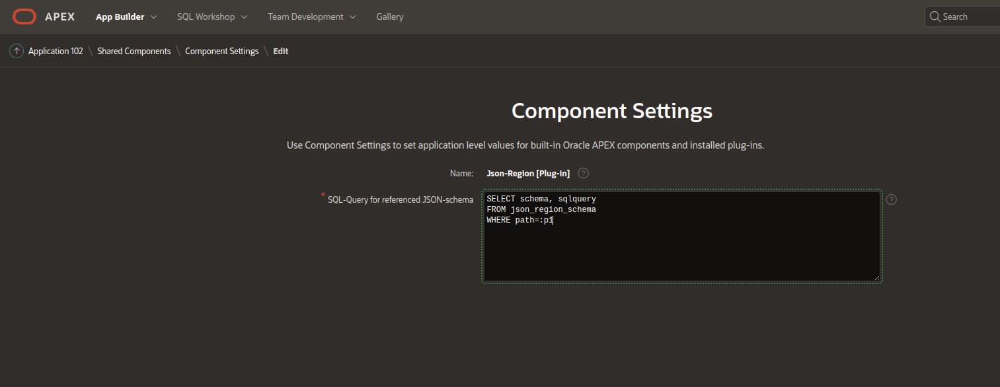

# Install the JSON-Region-plugin

The plugin is installed like every other plugin via **shared components->Plug-In->Import**. As file use the file **region_type_plugin_json_region_uwesimon_selfhost_e.sql** located in the directory **plugin**. In the import wizard, you can keep all steps on default.

When you see the **Component Settings** of the plugin, you can leave it as it is. 



This query is used to resolve **server local JSON-schema**-references. You can leave this field empty.
With the script **examples/create_json_region_schema.sql** you can create a table for resolving server JSON-schema-references. 
When this script was installed you can enter here
```SQL
SELECT schema, sqlquery
FROM json_region_schema
WHERE path=:p1
```
When using an application specific table adopt the query to your JSON-schema-reference table.
Otherwise leave it empty.

