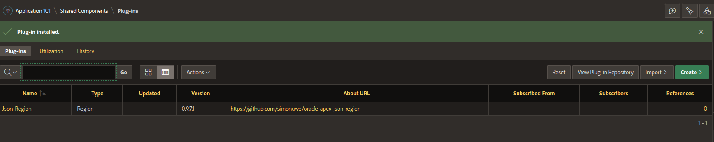

# Install the JSON-Region-plugin

The plugin is installed like every other plugin via **shared components->Plug-In->Import**. As file use the file **region_type_plugin_json_region_uwesimon_selfhost_e.sql** located in the directory **plugin**. In the import wizard, you can keep all steps on default.

When you see the **Component Settings** of the plugin, you can leave it as it is. 

This query is used to resolve **server local JSON-schema**-references. It is fine for the table created with the script **examples/create_json_region_schema.sql**. When not using the server local references you can ingore it.

After import of the plugin it should look like this.

