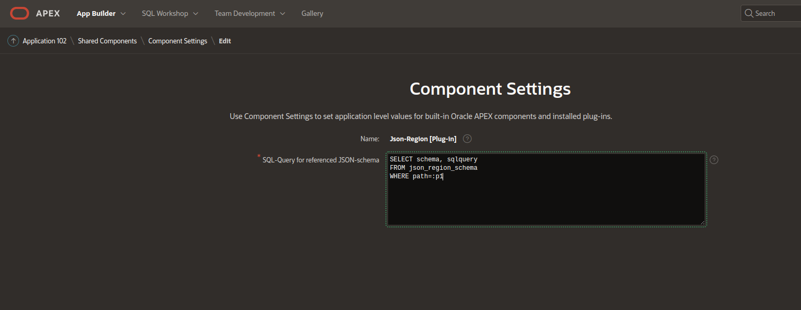

# Tutorial for the **JSON-Region-Plugin**
---
** Work in progress**

---

The concentrate on the important stuff, the tutorial will use a small application with tables containing JSON-data.
Here the JSON-data is shown in a **textarea**.

The tutorial then shows how to improve the pages with the **JSON-Region-Plugin** in some common use cases.

The **JSON-Region-Plugin** can be used in different configurations.

- JSON-data is to be displayed only with an automatic generated JSON-schema
- The JSON-data-column contains rows of a single JSON-schema only
- The JSON-data-column contains rows of several JSON-schemas identified by a "type-column"

- Oracle23ai
  - The JSON-data-column has a JSON-validate-schema constraint
  - The JSON-data is used from a Duality-view

**Important**:
The tutorial wil run with **Oracle-RDBMS >=19c** and **Oracle-APEX >= 22.1**

## Installation of the tutorial application

The application can be installed via **import** of the file **application_tutorial_221.sql**, which can be found in the directory **tutorial/scipts**.
This will install a small application including some tables and views.
The tutorial will show, how to install the plugin and how to usee the JSON-Region-Plugin in some common use cases.

If you are using a newer version of **APEX** than **22.1**, don't forget to **update** theme and application.

First refresh the **Theme** via **Shared Components->Themes->Universal Theme - 42->Refresh Theme**


Then Upgrade the application via **Utilities->Upgrade Application** 


Make sure that all components required a refresh are refreshed.

Now the application can be started.
It should look like


## Install the plugin
The plugin is installed like every other plugin via **shared components->Plug-In->Import**. As file use the file **region_type_plugin_json_region_uwesimon_selfhost_e.sql** located in the directory **plugin**. In the import wizard, you can keep all steps on default.

After import of the plugin it should look like this.


## Add the plugin to a page

This step will be always the same on all pages.
- Add a Region
- Set the **Name** to **JSON_REGION**" and select for **Type** the **Json-Region**


The JSON-data-items are always name **DATA**, so on tab "Atrributes" the JSON-item can always be set to the **P.._DATA** Item 


## Table already contains JSON-data

When a table already contains rows with JSON-data, this can be used for the **automatic schema-generation**.

### Automatic generation of an UI based on JSON-data 

The simples way to start with the **JSON-reqion-plugin** is using the **automatic generated JSON-schema**.

This works fine as long JSON-data is displayed only and you are hapopy with the default layout and UI-typetypes. 

In the Page builder go to the page **Generate JSON** (3).
As already shown above, create a region **JSON_REGION**. At **Attributes** select the JSON-Item **P3_DATA**. Set **Source** to **Static** . 

No start the application and select the **Fixed JSONs** menu. Click on the icon in one of the rows.


Another row looks like this.


You can see that some datatypes like **date** are automatically identified. 

**Caution**:
After emptying a field and saving, this fild will not appear again, because the UI is generated based on the existing data properties only.
When data is to be editied, a JSON-schema is required.
Without a JSON-schema the UI will contain no properties when creating new rows.

### Setting the JSON-Region to readonly

At the page set the JSON_REGION to **Read Only** **Always**.


After saving, the next call of page will show it in **readonly mode**


### How to get a generated JSON

When using the **automatic generation** the plugin generates a JSON-schema first.

To get the generated JSON-schem, start the "Developer-Tools" of your browser. The JSON-schema will be shown at the next call of the **Generated JSON** page as **Info**


The JSON-schema can be copied now as a master for further improvements.

### Fixed schema from a database-table

The page **Fixed JSON** (5) is used for a fixed JSON-schema.
Add a region of type **Json-Region**.
Switch on Headers (this will show additional header for sub-objects)


Copy the following JSON-schema into the field **Static Schema**
```JSON
{
  "type":"object",
  "properties":{
    "lastname":   {"type":"string"},
    "firstname":  {"type":"string"},
    "birthdate":  {"type":"string","format":"date"},
    "died_on":    {"type":"string","format":"date"},
    "address":{
      "type":"object",
      "properties":{
        "country":  {"type":"string"},
        "zipcode":  {"type":"string"},
        "city":     {"type":"string"},
        "street":   {"type":"string"}
      }
    },
    "creditcard": {
      "type": "object",
      "properties": {
        "cardtype": {"type": "string"},
        "number":   {"type": "string"},
        "validity": {"type": "string"}
      }
    }
  }
}
```
Now call in the menu the **Fixed JSONs** and select some of the rows. All pages now have the same fields.

### Improve the UI

Now we add some stuff to the JSON-schema to improve the layout and the usability.

Here is an improved version of the JSON-schema. Copy it it the field **Static schema**.
```JSON
{
  "type":"object",
  "required": ["lastname", "firstname"],
  "properties":{
    "salutation": {"type": "string", "enum": ["Ms", "Mrs", "Mr"]},
    "lastname":   {"type":"string"},
    "firstname":  {"type":"string"},
    "email":      {"type": "string", "format": "email"},
    "birthdate":  {"type":"string","format":"date"},
    "died_on":    {"type":"string","format":"date"},
    "address":{
      "type":"object",
      "properties":{
        "country":  {"type":"string"},
        "zipcode":  {"type":"string"},
        "city":     {"type":"string"},
        "street":   {"type":"string"}
      }
    },
    "creditcard": {
      "type": "object",
      "properties": {
        "cardtype": {"type": "string", "enum": ["Amex", "Diners", "Mastercard", "VISA"]},
        "number":   {"type": "string", "pattern": "[0-9]{4}( [0-9]{4}){3}"},
        "validity": {"type": "string"}
      }
    }
  }
}
```
This has some improvements for the usability:
- For **salutation** ans **cardtype** a list of valid values (enum)
- For the creditcard **number** a pattern (4 time 4digits).
- A field **email** with a format "email"

Enter in this fields some invalid values and try to **Save**.
You will see some errormessages.


## JSON-schema references

JSON-schema-references are used to include common subschema consitently, like an **address** for **home-address**, **billing-address** and **delivery-address**. They are defined by the key **"$ref"**. They 

The **JSON-Region-Plugin** supports several kinds of JSON-schema-references inside a JSON-schema

- document local with ```{"$ref": "#/$defs/abc}```
- fixed schema from a **schema-table** with ```{"$ref": "/defs/abc}```
- **enums** generated from the database with ```{"$ref": "/enum/abc}```
- schemas generated by a custom function
 
**Info**:
JSON-schema-references with an URL to a externel server are not supported yet.

### Table column with different JSON-schema 

A common usecase is a table where rows contain data of different JSON-schema depending on a **type**.
The page **Variable JSON** (7) is for this purpose.
Add a JSON-Region to this page, set the JSON-item to **P6_DATA** and set the **Source** to **SQL-Query**
In the field **SQL-Query** copy the following SQL.

```SQL
select json_schema
from json_type 
where json_type_id=:P7_JSON_TYPE_ID
```
Switch the **Headers** on.


Now go to the **Variable JSONs** report, you can see there 2 **JSON-types** **Car** and **Truck**.
Click on row of each of the types. You can see that different UIs are shown depending on the Type. The **JSON-schema** of each type is stored in a table **JSON_TYPE** in the column **JSON_SCHEMA**

### Schema references
To reuse JSON-schema the JSON-Region-plugin supports schema-references.

#### Document local reference

The object 
```JSON
("$ref": "#/defs/address")
```
references a schema with the path **defs.address** in the current JSON-schema.

Goto page **Fixed JSON** (5), change the **Static Schema** of the **JSON_REGION** th 
```JSON
{
  "type":"object",
  "required": ["lastname", "firstname"],
  "properties":{
    "salutation": {"type": "string", "enum": ["Ms", "Mrs", "Mr"]},
    "lastname":   {"type":"string"},
    "firstname":  {"type":"string"},
    "email":      {"type": "string", "format": "email"},
    "birthdate":  {"type":"string","format":"date"},
    "died_on":    {"type":"string","format":"date"},
    "address":    {"$ref": "#/defs/address"}, 
    "office":    {"$ref": "#/defs/address"}, 
    "creditcard": {
      "type": "object",
      "properties": {
        "cardtype": {"type": "string", "enum": ["Amex", "Diners", "Mastercard", "VISA"]},
        "number":   {"type": "string", "pattern": "[0-9]{4}( [0-9]{4}){3}"},
        "validity": {"type": "string"}
      }
    }
  },
  "defs": {
    "address":{
      "type":"object",
      "properties":{
        "country":  {"type":"string"},
        "zipcode":  {"type":"string"},
        "city":     {"type":"string"},
        "street":   {"type":"string"}
      }
    }
  }
}
```


This references the address-schema 2 times for **address** and **ofice**.
When you now click on a row **Fixed JSONs** report, you can see the 2 areas with addresses.

#### Server local reference

This tutorial install a table **JSON_REF_SCHEMA**.
This table configures for a **path** a fixed schema or an SQL-query which retrieves the schema or generates it. For this a database table is required. 

In the directory **tutorial/scripts** the file **create_ref_schema.sql** contains the DDL for the table used in this tutorial.
The file also contains a function, which can generate an **enum**-schema from a SQL-query.

The access to the table for the **server local references** can be configured at 
- component lelvel
- region level
When your application provides only a single table/query to access the schemas, configure it on **component level**



When you only use it only for a single region or you need different queries for your regions, configure it on **region-level** 


Enter here in the field **SQL-Query for referenced JSON-schema** the SQL-query
```SQL
SELECT schema, sqlquery
FROM json_ref_schema
WHERE path=:p1
```
To use the use the references configured in the table, change the ***State Schema** to 
```JSON
{
  "type":"object",
  "required": ["lastname", "firstname"],
  "properties":{
    "salutation": {"type": "string", "enum": ["Ms", "Mrs", "Mr"]},
    "lastname":   {"type":"string"},
    "firstname":  {"type":"string"},
    "email":      {"type": "string", "format": "email"},
    "related_to": {"$ref": "/enums/fixed_json"},
    "birthdate":  {"type":"string","format":"date"},
    "died_on":    {"type":"string","format":"date"},
    "address":    {"$ref": "/defs/address"}, 
    "office":     {"$ref": "/defs/address"}, 
    "creditcard": {
      "type": "object",
      "properties": {
        "cardtype": {"type": "string", "enum": ["Amex", "Diners", "Mastercard", "VISA"]},
        "number":   {"type": "string", "pattern": "[0-9]{4}( [0-9]{4}){3}"},
        "validity": {"type": "string"}
      }
    }
  }
}
```
This will contains **address** and **office** which references the address-schema from the configuration table and also a generatet **enum** for **related_to**. The enum is generated from the **id** and **name** of the table **fixed_json**. So when you enter a new person, it will appear in the List of **Related To** at the next call.

#### Server generate schema


## Oracle23ai

### Table with JSON-column and VALIDATE constraint

When you are familar with JSON-schema, you can change the VALIDATE constraint (add a new column)
You can find An ATLTER-table-statement in the file **install-tutorial-23ai.sql**
below the line containing **VALIDATE JSON-schema**
First drop the Constriant and then call the ALTER statment with th modified JSON-Schema.
Now you can see that after this change the UI at the next call.

### Duality-View