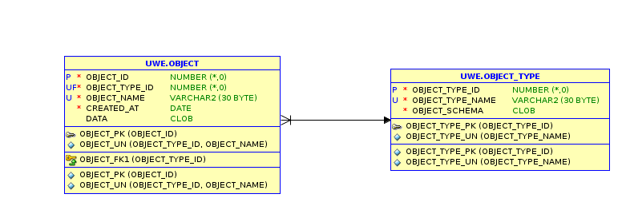

# Demo

An online-demo could be found **[here](https://tlodfjxbrej9i6r-apex01.adb.eu-frankfurt-1.oraclecloudapps.com/ords/r/uwe/json-region-demo/objects)**. 

You can create create here new objects and edit existing with varying JSON-schemas. 

When creating a new object you can select one of the existings schemas in **object_types**. Type **Full-Example** and **Hotel** both together show the variaty of supported field-items/formats.

Clicking on **Help** will show the **JSON-schema** and the **JSON-data** of the current object.

Click here on **menu** on top left and there on **objects**

The the datamodel looks like this.

The table **OBJECT_TYPE** contains in column **OBJECT_SCHEMA** for every objecttype the JSON-schema. The table **OBJECT** references the **OBJECT_TYPE** and contains in column **DATA** the variable JSON-data.

# Example-application

The subdirectory **examples** contains the demo-application to show the possibilities. Go into this directory and install from there.

