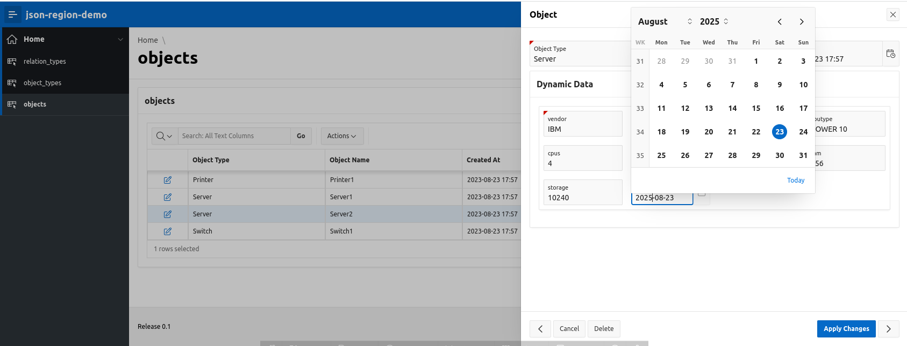
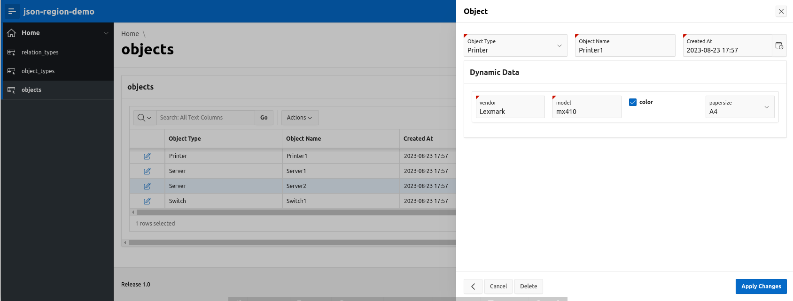
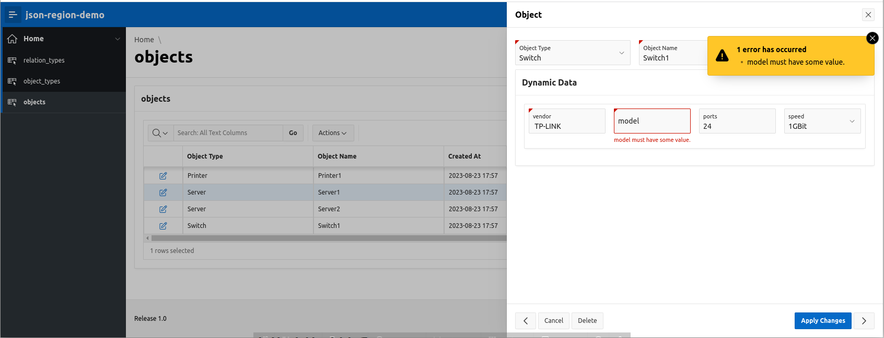

# generic database example

## Screenshots





## Installation of the DEMO-application

The demo application installs objects depending on the Oracle-DB-Release.
When  installed in an Oracle23ai database, you will see an additional duality-view **JSON23AI** and an additional table **OBJECT23AI** with a JSON-validate-constraint.
The demo application will contain additional options for this object in the main-menu too.

### Import the demo application

Import the application from file **json-region-demo.sql**, do'nt forget to install the supporting objects.

### Upgrade application to your APEX-version

When the import was successfully completed, for newer versions of APEX (application is xported with 20.2) a button "Upgrade Application" appears. Upgrade all entries in the upgrade list here.
Upgrade could be found at **Utilities->Upgrade Application**.

### Upgrading the theme

After the installation has finished, upgrade the theme with **Shared Components->Themes->Universial Theme42->Refresh Theme**.
Without this, the UI will not always behave/look as expected.
When you receive an "compatibility mode" error here, upgrade the compatibility mode first, so it matches your APEX-version.  

### Installation of the plugin-support-table for JSON-schema-references

This is automatically installed when importing the application **json-region-demo**.


The script 
```
  create_json_region_schema.sql
```

installs the additional table **JSON_REGION_SCHEMA** and the function **JSON_REGION_GENERATE_ENUM** for JSON-schema references and dynamic JSON-schema.
These are used when you select for **object_type_name** values which name starts with **test-ref-**.

**Caution:** The Demo works for APEX >=21.2
With **APEX>=23.2** the **fileupload** **imageupload** is supported. When using this, change in **Page 11 object** the **Session State** **Data Type** to **CLOB**, otherwise **files > 8000 Bytes** return **ORA-40441: JSON syntax error** or similar - truncated JSON.
In 21.2 it is not possible to specify the datatyp of the session state.

# APEX >= 24.2 and AI

To activate the AI Feature
- Oracle DB 23 ai and APEX >=24.2
- Enable AI in the APEX-instance for your workspace **AI Services** set **AI Enabled**
- In Workspace at **Workspace Utilities->Generative AI Services** create a **AI Service** for your AI provider 
- At **Shared components->Generative AI Service** create an **Generative AI Service**
- At **Shared components->Generative AI Configuration** create a configuration with **static id** named **generate_json_schema** and reference your **Generative AI Service**. For the **System Prompt** copy the following 

```
Generate a json-schema for the user prompt, return JSON only.
- Optional itemtypes from itemtype list with values "switch", "starrating", "selectone", "selectmany", "combobox", "richtext", "radio", "fileupload, "imageupload", "qrcode".
- Additional properties in "apex": {} are "itemtype", "filesize", "mimetypes", "newRow", "colSpan" 
- Merged all additional properties into "apex": {}.
- "fileupload" and "imageupload" have "type": "object"
- For each property with an itemtype for the list add the itemtype as parameter to the "apex": {"itemtype": parameter} to the property.
- Remove empty "apex" objects.
```

**Caution**: This is tested with Cohere-AI, but should work with ChatGPT, .. the same way.

### Deinstallation of the plugin-support-table

This is automatically deinstalled when deleting the applications  **json-region-demo** including the **supporting object*.

The script 
```
  create_json_region_schema.sql
```
whill drop the additional objects for JSON-schema references and dynamic JSON-schema.

### Deinstall the demo application

When deleting the demo application don't forget to delete the supporting objects too.
